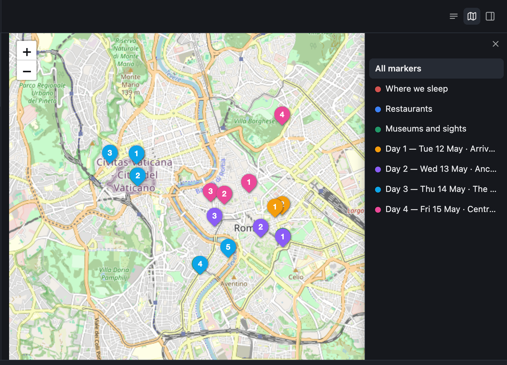

# Welcome to your WebVault 👋

You deployed this in a few clicks. It's a **starter vault** — a tiny Markdown knowledge base with WebVault already wired in. Right now the site is **public and read-only**. Two unlocks finish the setup: the first closes the site to everyone but you, the second lets you edit from the browser.

## ✅ Finish your setup

- [ ] **🔒 Make it private (⚠️ important).** Until you do this, anyone with the URL can read your vault. Gate the site with **Cloudflare Access / Zero Trust** so only you can read it, while `/shared/<id>/` links stay public. Follow [WebVault's Access setup steps](https://github.com/marconucara/web-vault/blob/main/DEPLOY.md#3-gate-the-site-with-cloudflare-access).
- [ ] **✏️ Turn on web editing.** Create a [fine-grained GitHub token](https://github.com/settings/personal-access-tokens/new) with *Contents: write* on this repository only, then add it to your Worker (Settings → Variables and Secrets) as a secret named `GITHUB_TOKEN`. Then this note becomes editable and your changes commit straight back to the repo.
- [ ] **🗺️ (Optional) Speed up maps.** Any Google Maps link in a note becomes a place card and a pin on a map — there are examples further down this note. If you add *many* pins, set `MAP_CACHE_KEY` + `SITE_URL` as **build** variables to cache those lookups between builds. Skip it until you need it.

## Get to know WebVault

Five things to try. Nothing here is required reading — poke at whatever looks useful and come back later for the rest.

### ✍️ Try the editor

Your notes stay plain Markdown on disk, but you don't have to write it by hand. The editor formats as you type: `**bold**`, `*italics*`, headings, tables, code, quotes, and task lists all render live.

- [ ] Tick this box — it's a real Markdown task list
- [ ] Press `/` on an empty line to pick a block type
- [ ] Select some text to get the formatting toolbar

Everything you write is saved back as ordinary Markdown, so the vault stays readable — and editable — outside WebVault too.

### 🔗 Link notes together

Typing two square brackets in the editor opens a picker of your notes, and picking one drops in a link like [[welcome]]. Links are how a pile of notes turns into something you can navigate: follow one, and the note it points at opens.

### 🗺️ Drop a place on the map

Paste any Google Maps link and it becomes an interactive **place card**. The link text is yours to write — treat it as a note to yourself about the place, not just its name:

1. https://maps.app.goo.gl/tsNtY7RE3xrHDpEA9
2. https://maps.app.goo.gl/2HXLY9kL6q124FuA7
3. https://maps.app.goo.gl/XW2d4k9eK1RuWg618

Put your places in a numbered list and each pin picks up its number, so a card and its marker on the map are easy to match — which is what turns a day of an itinerary into something you can actually read. [[rome-in-5-days]] is a worked example: a five-day trip with every restaurant, museum and stop as a pin.

Every pin in a note also collects into a **map view** for that note, reachable from the top bar (see below). Here is the Rome trip's, where each list in the note became its own colour and the numbers are the ones from the itinerary:

That screenshot doubles as the example for the other thing a vault holds: drop a file into `attachments/` and reference it with ``. Places themselves are looked up when the site builds, not when you open the note — which is what the optional maps cache above makes faster.

### 🧭 Explore the sidebar

The sidebar has three parts, top to bottom.

**Built-in views** come with WebVault and are always there:

- **All notes** — everything in the vault.
- **Inbox** — notes you haven't filed yet. A note leaves the Inbox once it has `_organized: true` in its frontmatter.
- **Shared** — the notes currently published as public links.

**Saved views** are yours. Each is a `views/*.yml` file describing what to show and how to sort it — **Start here** is the one this template ships with. Add a file, get a view.

**Types** group notes by what they *are*. A note declares one with `type:` in its frontmatter, and every type in use becomes a sidebar entry. A type document is just a note that sets its icon, colour, and description — add a file to `_types/` to define your own. This template ships with six, each with an example note to look at:

- **Project** — an initiative with a goal and an end, gathering the notes under it. See [[kitchen-renovation]].
- **Person** — someone the work involves; link them with `[[Their Name]]`. See [[marco-nucara]].
- **Topic** — a theme that runs across projects and never really finishes. See [[home]].
- **Recipe** — your own cookbook, the version that beats whatever you find online. See [[pasta-e-ceci]].
- **Trip** — a destination from first idea to itinerary. See [[rome-in-5-days]].
- **Note** — anything general. When in doubt, it's a Note. This note is one.

A type only shows up in the sidebar once at least one note actually uses it, so deleting the examples for a type you don't want makes it disappear.

Views and types are edited as files rather than through the interface for now.

### 🧰 The top bar

Four buttons sit above every open note, and they are worth knowing:

- **Edit source** swaps the visual editor for the raw Markdown — the exact characters on disk. Useful when you want precise control over the syntax, or just to see what the editor has been writing for you.
- **Map view** switches the note to the map of its pins, with the numbered markers described above. It only has something to show when the note contains Google Maps links — open it on [[rome-in-5-days]] to see a whole itinerary at once.
- **Properties** opens a panel with the note's type, its frontmatter fields, and the notes it links to. It's read-only — edit the values in the frontmatter itself.
- **Share** publishes one note — and only that note — at a public address anyone can open, while the rest of your vault stays private.

A small marker also appears next to the title when a note has changes that haven't been committed back to your repository yet.

### 🔗 Sharing a note

Sharing gives the note an id, writes it into the note's frontmatter as `share_id`, and commits that change to your repository. The commit triggers a rebuild, and when the site comes back up the note is live at `/shared/<id>/` — a standalone page with no sidebar, no editor, and no way back into the rest of the vault. Expect to wait a couple of minutes for the build; the button keeps checking and copies the link once it's really up.

Two things it needs. The **GitHub token** from the setup above, because sharing works by committing to your repository. And a **Cloudflare Access policy that keeps the share paths public** — without it your own gate blocks the very people you shared with. Both are covered in [WebVault's Access setup steps](https://github.com/marconucara/web-vault/blob/main/DEPLOY.md#3-gate-the-site-with-cloudflare-access).

Unsharing works the same way in reverse: the id comes out of the frontmatter, the page stops existing at the next build. Anyone still holding the old link gets nothing.

## Make it yours

1. **Edit this note** (once the token is set) or delete it — every note here is just an example, and so are the folders they sit in.
2. **Add your own notes**: drop `.md` files anywhere in this repository.
3. **Organise with views and types**: saved views live in `views/*.yml` — see **Start here** in the sidebar — and types in `_types/`.
4. **Share a note**: publish it as an isolated public `/shared/<id>/` link while the rest of your vault stays private.

Every push to the repository rebuilds and redeploys the site, and so does every edit you commit from here.

Full setup notes live in the `README.md` of the GitHub repository this site was deployed from — the one Cloudflare created for you. The deploy and hosting side is documented in [WebVault's DEPLOY.md](https://github.com/marconucara/web-vault/blob/main/DEPLOY.md).
